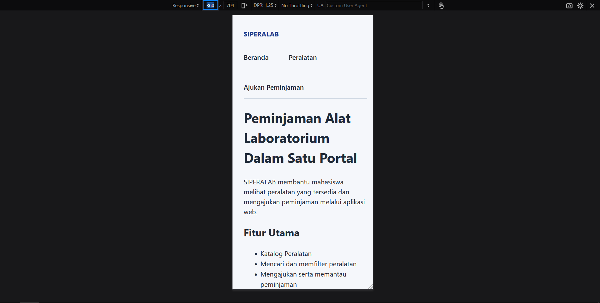

# Audit Modul 4 - Flexbox, Grid, dan Responsive Design

## Hasil uji viewport
| Viewport | Gejala awal | Penyebab | Perbaikan | Hasil uji ulang |
|---|---|---|---|---|
| 360 px |Menu pada header dan footer tidak responsif terhadap viewport |Width rule header dan footer tidak mengikuti width rule `main` |Width rule header dan footer menggunakan `min(1100px, calc(100% - 2rem))`, sama dengan `main`  |Header dan footer sudah dalam posisi yang sesuai  |
| 768 px |Menu pada header dan footer tidak responsif terhadap viewport dan masih sulit dibaca |Width rule tidak mengikuti `main` |Width rule mengikuti dari `main` |Header dan footer sudah dalam posisi yang sesuai  |
| 1280 px |Semua elemen dapat dibaca dengan baik tanpa terpotong atau harus digulir ke samping |-  |-  |-  |

## Audit overflow
- Elemen yang menyebabkan overflow: `.site-header`, `footer`
- Bukti dari DevTools: Menu `nav` pada viewport 360 dan 768 tertambat ke kanan dan tidak rapi.
- Aturan penyebab: `margin: 0 12rem` (margin tetap sebesar 192px yang tidak terpengaruh viewport)
- Perbaikan: Menggunakan `width: min(1100px, calc(100% - 2rem))`, `margin-inline: auto`, dan `flex-wrap: wrap` pada header dan nav
- Hasil uji ulang: 
